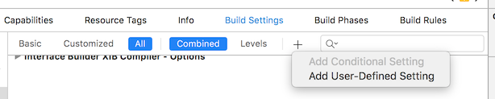
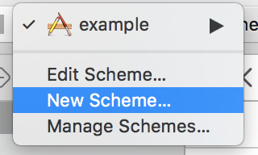

# React Native Confidence

## Introduction

This library was inspired by the hapi configuration module confidence.
We started by trying to use confidence directly in our react-native applications but quickly found that some modules referenced were not available.

## Installation

```bash
npm install --save react-native-confidence
react-native link
```

## iOS

Once the module is installed there are a few more steps required to complete the configuration in iOS.

### Configuring iOS Project

Open up your iOS project and select your project root in the navigator, select your build target and select the Build Settings tab


### Add User Defined Build Setting BUILD_ENV

At the very bottom of the build settings there is a section for USer-Defined entries.
We need to add a new value to this section by pressing the '+' symbol near the top of the screen.


### Set values for your configurations

Give the new setting a name **BUILD_ENV** which we will reference later.
Expand the setting, clicking on the arrow at the far left, to see what the value will be for each build configuration.
Update the Debug setting to _development_ and the Release setting to _production_. 


### Load up your application's Info.plist file

Now we need to make this value available to our configuration selection inside react-native.
We do this by referencing the **BUILD_ENV** in out application's plist and then expose that over the react-native bridge.
Find your application's Info.plist in the file navigator.


### Add BUILD_ENV to plist

Add a new entry to the file, by clicking on the + icon on the top row.
It is important that the name of the entry is BUILD_ENV and that the value is the same as the entry you put in the build settings.


## Android

Add this to the app/build.gradle file

```json
    buildTypes {
        debug {
            buildConfigField "String", "build_env", "\"development\""
        }
        release {
            buildConfigField "String", "build_env", "\"production\""
            ...
        }
    }
```

Update MainApplication.java to pass the build environment through to the library.

```json
...
    protected List<ReactPackage> getPackages() {
      return Arrays.<ReactPackage>asList(
          new MainReactPackage(),
          new RNConfidence(BuildConfig.build_env)
      );
    }
...
```

## Usage

We are now set up so that we can create a configuration file in json.

```config.json```

```json

{
  "$meta": {
    "description": "This is an example of the metadata"
  },
  "apiURL": {
    "$filter": "env",
    "production": "THIS IS PRODUCTION",
    "development": "THIS IS DEVELOPMENT",
    "$default": "THIS IS DEFAULT"
  }
}

```

Anywhere that we want to use our configuration we can filter it through RNConfidence.
With the iOS version we can access anything that is in the application's main bundle, the Info.plist mentioned above.

```index.ios.js```

```javascript

import RNConfidence from 'react-native-confidence';
import Config from './config';

...
constructor() {
  super()

  this.confidence = new RNConfidence(Config);
}

render() {
    return (
      <View style={styles.container}>
        <Text style={styles.instructions}>
          BUILD Environment: 
          { this.confidence.getBuildEnv() }
        </Text>
        <Text style={styles.instructions}>
          Value from InfoPlist: 
          { this.confidence.getPlist().CFBundleIdentifier }
        </Text>
        <Text style={styles.instructions}>
          Meta Filter: 
          { this.confidence.meta('/').description }
        </Text>
        <Text style={styles.instructions}>
          Filter: 
          { this.confidence.get('/apiURL') }
        </Text>
      </View>
    );
  }
}
...
```

On Android there isn't a plist entry, so we do not have access to that. 

```index.android.js```

```javascript

import RNConfidence from 'react-native-confidence';
import Config from './config'; 

export default class example extends Component {
  constructor() {
    super()

    this.confidence = new RNConfidence(Config);
  }
  render() {
    return (
      <View style={styles.container}>
        <Text style={styles.welcome}>
          Welcome to React Native!
        </Text>
        <Text style={styles.instructions}>
          BUILD Environment: 
          { this.confidence.getBuildEnv() }
        </Text>
        <Text style={styles.instructions}>
          Meta Filter: 
          { this.confidence.meta('/').description }
        </Text>
        <Text style={styles.instructions}>
          Filter: 
          { this.confidence.get('/apiURL') }
        </Text>
      </View>
    );
  }
}

```

## Creating more environments

The setup described above allows for two environments, 'development' and 'production' as these are the values entered in the iOS Build Settings and the Android build.gradle file.
If you would like to have more options for filtering you will need to follow the process outlined below.

### iOS Environments

#### Create a new configuration

Select your project root in the file navigator.
Select the project in the main window and make sure that the Info tab is selected.


Click on the + button and duplicate one of the existing configurations.


Go back to the build settings, where we configured the user defined settings earlier.
You should now see the new configuration option under the BUILD_ENV setting.


Update this new setting to be another filter, e.g. _staging_


We need to update our scheme or create a new one to leverage the new configuration.
Create a new scheme

Then start editing it

Update the build and archive configuration options


We can now update our configuration file to reference the new option.

```config.json```

```json
{
  "$meta": {
    "description": "This is an example of the metadata"
  },
  "apiURL": {
    "$filter": "env",
    "production": "THIS IS PRODUCTION",
    "development": "THIS IS DEVELOPMENT",
    "staging": "THIS IS STAGING",
    "$default": "THIS IS DEFAULT"
  }
}
```